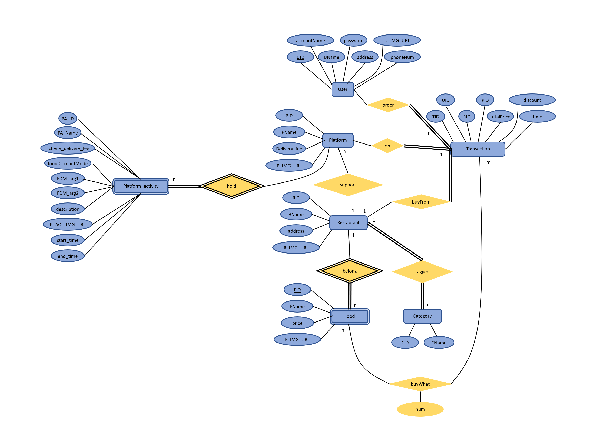

# 外送平台系統

## Databse Requirement
### 說明
粗體的attribute代表它為該relation的primary key

### Entity
* 對於每一個用戶(User)，它有
  * __唯一的UID__
  * 姓名(Uname)
  * 帳號名稱(account)
  * 密碼(password)
  * 地址(address)
  * 連絡電話(phone)
  * 照片(U_IMG_URL)

* 對於每一個外送平台(Platform)，它有
  * __唯一的 PID__
  * 名稱(PName)
  * 運費(shippingFee)
  * 照片(P_IMG_URL)

* 對於每一個平台活動(Platform_activity)，他是外送平台的weak entity，它有
  * __外送平台(PID)__
  * __平台活動識別碼(PA_ID)__
  * 名稱(PA_Name)
  * 活動期間運費(discount_shippingFee)
  * 食物折扣模式(foodDiscountMode)
  * 食物折扣模式_計算用參數1(FDM_arg1) # 當該欄位為null時，表無此參數
  * 食物折扣模式_計算用參數2(FDM_arg2) # 當該欄位為null時，表無此參數
  * 活動敘述(description)
  * 照片(P_ACT_IMG_URL)
  * 開始時間(start_time)
  * 結束時間(end_time)

* 對於每一個餐廳(Restaurant)，它有
  * __唯一的 RID__
  * 名稱(RName)
  * 地址(address)
  * 照片(R_IMG_URL)

* 對於每一個食物(Food)，他是餐廳的weak entity，它有
  * __所屬餐廳(RID)__
  * __唯一的 FID__
  * 名稱(Fname)
  *	價格(price)
  * 圖片(F_IMG_URL)

* 對於每一筆交易(Transaction)
  * __唯一的TID__
  * 用戶(UID)
  *	餐廳(RID)
  * 使用平台(PID)
  *	原始總價(totalPrice)
  * 獲得折扣(getDiscount)
  * 交易時間(time)
  * 交易食物 # 會被正規化
  * 交易食物數量 # 會被正規化

### Relationship
* 每一家餐廳可以有0項以上的食物，同時每一種食物必定對應到一家餐廳
* 每一家餐廳必須支援只少1家的外送平台，同時每1家外送平台可以對應0家以上的餐廳
* 每一家餐廳至少擁有1個分類，同時每1種分類可以對應0家或以上的餐廳
* 每一筆交易紀錄必定會對應到1位用戶、1家餐廳和1家外送平台，同時用戶、餐廳和外送平台可以擁有0筆以上的交易紀錄
* 每一筆交易紀錄至少對應1筆食物，每一個食物可以對應0筆以上的交易紀錄，同時交易紀錄應包含選購食物數量的資訊
* 每一個外送平台可以對應0筆以上的平台活動，每一筆活動只能剛好對應到1個外送平台

## ER_diagram

## 圖片來源:
本資料庫實作僅供學術研究使用，餐廳及食物部分的圖片均來源於UberEats、平台圖片則得自於google search，其著作權皆屬原作者所有。 如有侵權或原著作者與分享者不同意轉貼，請立即告知，本人將立刻處理並刪除檔案。
